# CSCI24000_spring2021_final_project
Joshagachi
>Tamagotchi but with my funky creatures
>This was a Java project for my 240 class, and I'm so happy to find it again!
>
>It was exhausting working with Java and JFrames to create this application. It's also hard to share because it's only an executable, you can't run it on a website. 
>
>I did learn about window management which is kinda fun, but still exhausting. Lots of work just making sure each window understands who said what.
>
>The reason I thought I lost it is because right after I presented, I deleted Eclipse and removed the repo from my computer. Thanks to IU GitHub though, we still got it!

All the art was done in Aesprite
## Joshagachis

| Creature | default | eating1 | eating2 | ......full1 | ......full2 | hungry1 | hungry2 | .......sad1 | .......sad2 | .....tired1 | .....tired2 |
| --------- | -------- | -------- | -------- | ----- | ----- | --------- | --------- | ----- | ----- | ------- | ------ |
| Blob | 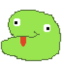 | 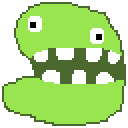 | 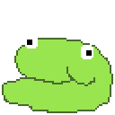 | 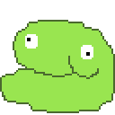 |  | 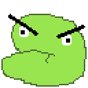 | 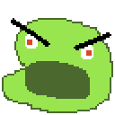 | 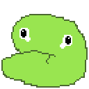 | 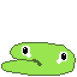 | 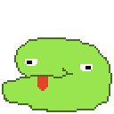 | 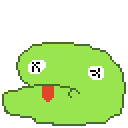 |
| Ghost | 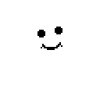 | 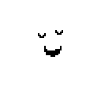 | 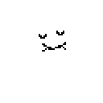 | 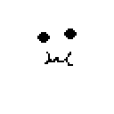 | 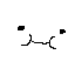 | 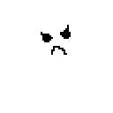 | 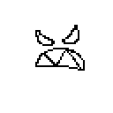 | 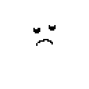 | 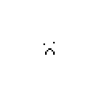 | 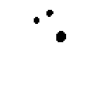 |  |
| Octopus | 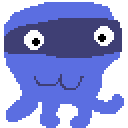 | 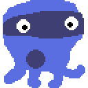 | 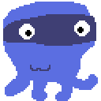 | 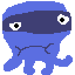 | 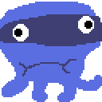 | 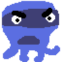 | 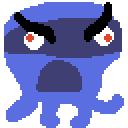 | 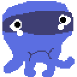 | 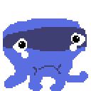 | 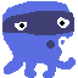 | 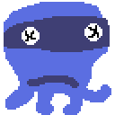 |
| Pumpkin | 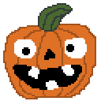 | 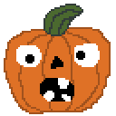 | 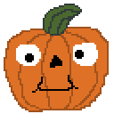 | 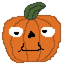 | 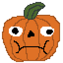 | 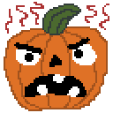 | 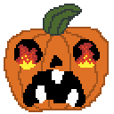 | 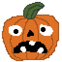 | 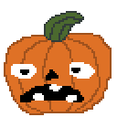 | 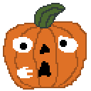 | 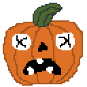 |
| Snake | 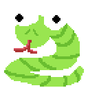 | 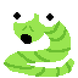 | 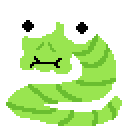 | 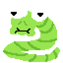 | 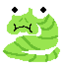 | 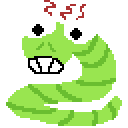 | 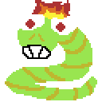 | 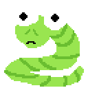 |  |  |  |

# Window Titles

# UML

[.png)](./Joshagachi(1).png)

# Algorithm

This was written in a txt file, and assignments in 240 were submitted with a GOALS, INPUTS, OUTPUTS, STEPS style. 

- Goals
	- What is your goal with this project/assignment, what features or functionality are you planning on designing?
- Inputs
	- What is your program receiving from the user, what is coming in and how do you parse that?
- Outputs
	- (bigger section usually)
	- What is the user seeing?

## UPDATE: PLS READ

I have ran into multiple problems getting the .jar file to work correctly. I have a jar file in the repository but it won't have images no matter how many times I tell it to include the assets folder. Even having the images in the same directory as the .java files, the .jar will not see them. So the .jar works, you just can't open up the food or game shop so you can't feed the Joshagachis. To have you, the grader, play the game as intended, I included the a .zip of the eclipse project. If you have the eclipse IDE, you can File->Import->General->Existing Projects Into Workspace->Select the .zip "FinalProjectEclipse.zip" as the archive file or set the root directory to the folder I made, EclipseProject, either one should be able to get 'SwingTest' the project imported, and then you can run the User.java main method and have the program work perfectly.

If that's too annoying, I get it, I have the .jar in the GitHub repository as Joshagachi.jar. I just couldn't get those stupid images to work.

## GOALS

I would like to make a Tomagachi-esc style game through Java. I think I will call it Joshagachi because I am very good at naming things. I feel confident in doing it through the console, but to make it interesting and show I'm learning something I want to do this through windows, using the swing library and JFrames.

I'd like for there to be different kinds of Joshagachi, different species with their own sprites. Each one should have sprites for when they're hungry, full, sad, dead, etc. I also want them to animate when they eat something with mouth open and close.

There will be a Food Item and Accessory item, one is consumable the other is permanently equipable for whatever Joshagachi you want. each have an integer that will modify the amount they affect the Joshagachi' s stats. Speaking of stats, I was inspired by thinking of the feelings of a Joshagachi like a compass, they can get hungry or they get full if you feed them to much. They can get sad if you don't play and exhausted if you play to much. I'll label each axis foodLevel and energyLevel and have them range from -1 to 1 as doubles, that makes sense to me, with a default happiness at 0,0.

I came up with this idea the week before we did the Perfect Pet project, and after doing it I learned a lot about what I'm looking for in data persistence. I need to have files for both types of items, and other files for the current inventory of the player. Not mentioning the file for storing the Joshagachi.

## INPUTS

User will type in their name when first starting program, then can choose a Joshagachi from a list of three, that will be randomly generated each time. This will not display the next time the program runs because a file will have their name and Joshagachi(s) on it

User sees grid of Joshagachi in a pet menu, and when clicking on one will display the menu for that pet. They can play or feed the pet.

To play or feed the pet, they need to acquire food or games from the respective stores, which will have a grid of possible things to get and when clicked adds to the User's inventory

Menu will display options for user when they want to play or feed their pets.

## OUTPUTS

Joshagachi will have eating animation when eating something

buttons will be dynamically generated when more things are added to display

multiple windows exist for the PetMenu, UserCreation, PetDisplay, and Shops and can interact with each other

Sprites for Joshagachi change depending on their status

## STEPS

The User class will be the main class, as that's the first thing that loads in and can contain most of the data. Instances of the user will be passed to other classes like Pet and PetMenu so that they can access the class inside of their class.

There will be an Abstract class Item, that has some attributes like name, that 2 other classes Food and Accessory will inherit from. This abstract class can by the type for arraylists later in the project, so I can have food and Accessories in a linked list for inventories.

The User will load the pets.txt, and if it doesn't see anything will run the newUser function so a name for the user is established and a Joshagachi can be given. If the program loads and finds that data, it skips the step and goes straight to the PetMenu so the Player can get to their Joshagachi

The Joshagachi are also stored in a linked list, so the PetMenu can dynamically increase or decrease the amount of buttons on the screen. That makes it easy to add Joshagachi from the newPet() function too.

The Pet class (Joshagachi) contains a HashMap with a key for the state, and the value being the file path to that sprite.png. This is set up automatically for every pet, and as long as a folder exists for the species and the files are labeled correctly, everything should work.

The Pet menu has to access the display() method in the Pet class, but has no instances of the Joshagachi inside of itself. That's why I have a User in the constructor so when the PetMenu is created, the user is passed along with it so it can access the ArrayList from User and then call display when necessary.

Pet also has a similar story as above, it needs to access the player's inventory when creating the consumable menus. So the user is passed with the pet constructor.
